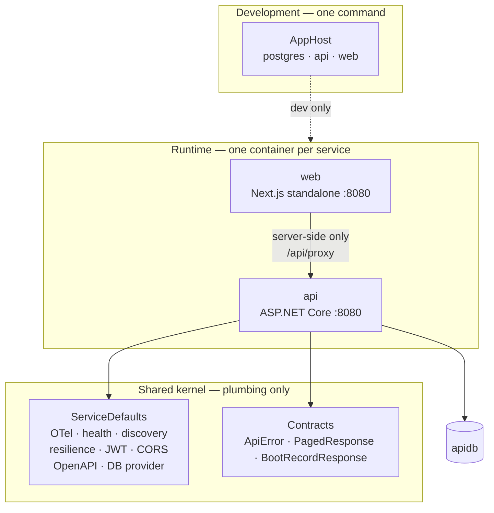

# This repository, measured against the constitution

The architecture is not defined here. It is defined once, for the whole estate, in
[`00-REFERENCE-ARCHITECTURE.md`](https://github.com/konradcinkusz/architecture-standards/blob/main/docs/architecture/00-REFERENCE-ARCHITECTURE.md)
(P1–P15), and this document says **where this repository stands against it** —
nothing more. Restating the principles here would create a second copy to drift
from the first.

- The decisions this repository took are in [`../adr/`](../adr/).
- The deviation register is §3 below, and it is currently empty.

## 1. What this system is

One bounded context, one service, one database, one product surface.

| Piece | Project | Owns |
|---|---|---|
| Composition root (P1) | [`src/…AppHost`](../../src/ArchitectureStandardsInitExample.AppHost/) | the development topology; **not** the production one |
| Shared kernel (P2) | [`src/…ServiceDefaults`](../../src/ArchitectureStandardsInitExample.ServiceDefaults/) | P2's eight plumbing concerns, 442 lines |
| Contracts | [`src/…Contracts`](../../src/ArchitectureStandardsInitExample.Contracts/) | DTOs that cross a boundary |
| The service (P3) | [`src/…Api`](../../src/ArchitectureStandardsInitExample.Api/) | `apidb`, `/health`, `/alive`, `/api/boots` |
| Product surface | [`web/app`](../../web/app/) | the browser's only origin |

## 2. The compliance checklist

The constitution's §3, answered for this repository. Every "yes" below is backed
by something mechanical — a test, a CI step, or a post-deploy assertion — not by
an assurance.

| Item | Status | Where it is enforced |
|---|---|---|
| Declared in the AppHost with `WithReference`, `WaitFor`, `WithHttpHealthCheck` | yes | [`AppHost.cs`](../../src/ArchitectureStandardsInitExample.AppHost/AppHost.cs) |
| Calls `AddServiceDefaults()` and `MapDefaultEndpoints()` | yes | [`Program.cs`](../../src/ArchitectureStandardsInitExample.Api/Program.cs) |
| Exposes `/health` and `/alive`; the platform check points at `/health` | yes | `api.fly.toml`; `HealthEndpointTests` |
| Emits OTLP traces, metrics and logs | yes | `Extensions.ConfigureOpenTelemetry` |
| Owns its database; no other service connects to it | yes | one service exists; the AppHost hands `apidb` to it alone |
| Schema applied by `MigrateAsync` from migrations, in a hosted service | yes | `MigrationHostedService`; asserted after every deploy |
| No secret in source, config or comment; scanner in CI | yes | `.gitleaks.toml`, pre-commit hook, `secret-scan.yml` |
| Exactly one service holds a signing key; others validate against JWKS | n/a | no accounts, no key material anywhere ([ADR-0004](../adr/0004-no-user-accounts.md)) |
| Kernel holds no entity, DTO, enum, seed dataset, pricing constant or string | yes | `KernelBoundaryTests` + the `kernel-size` CI step |
| Every optional integration has a working no-op or fallback | yes | `IntegrationStatus`; the E2E suite boots with zero configuration |
| `/health` reports every optional integration; the banner prints the same list | yes | one source (`IntegrationStatus`), two surfaces |
| Multi-stage Dockerfile; runtime major = TFM major; `:8080`; non-root | yes | both Dockerfiles; verified by running each image |
| One `fly.toml`; `min_machines_running = 1` if called in-request | yes | `api` pins 1, and the call is named in the file |
| Outbound clients carry resilience and explicit timeouts | yes | `ConfigureHttpClientDefaults`; the BFF proxy's 30 s abort |
| `Program.cs` is a manifest; wiring in `ServiceCollectionExtensions` | yes | 30 lines, every block one call |
| Extension points are interfaces in DI, not base classes | yes | `KernelBoundaryTests` asserts nothing inheritable is exported |
| Has a test project covering the logic-bearing layer | yes | 10 unit/integration tests, 4 E2E |
| Built by the tag-driven workflow with change detection | yes | [`flyio.yml`](../../.github/workflows/flyio.yml) |
| Architectural decisions recorded | yes | [`../adr/`](../adr/) |

Two items read **n/a** rather than **no**, and the difference matters: there is no
identity service to hold a key, because there are no accounts. That is a recorded
decision with its consequences written down, not an unmet requirement.

## 3. Deviation register

A principle whose named violation stays open indefinitely reads as optional. This
table holds every departure from the constitution that is **still unfixed**, with
the date it opened and its reason. When one is fixed, its row is deleted. **An
acknowledged deviation is a decision; an unacknowledged one is drift.**

| Since | Deviation | Principle | Reason, or the plan |
|---|---|---|---|
| — | *(none)* | | |

The register is empty at the first commit. That is the only moment it is expected
to be, and it is not a claim that this repository is finished — it is a claim that
nothing it does today knowingly departs from the constitution.

Three things worth stating so nobody files them as findings, because each is a
recorded decision rather than a gap:

- **No SQL Server migrations**, though the kernel offers the provider —
  [ADR-0005](../adr/0005-postgresql-migrations-only.md).
- **No auth anywhere**, and two kernel extension methods with no caller —
  [ADR-0004](../adr/0004-no-user-accounts.md).
- **An evaluation-only Aspire API in the AppHost** —
  [ADR-0006](../adr/0006-experimental-aspire-nextjs-api.md).

## 4. What this repository deliberately does not have

From the constitution's §4 non-goals, so scope creep has something to fail against:

- **No second service.** A second bounded context is a design decision with a
  reason, not a scaffolding default (P3).
- **No event bus, no service mesh, no sidecars.** Synchronous HTTP against a
  published contract is the whole model at this size. Introducing a broker is an
  explicit, recorded decision.
- **No custom DI container** and no abstraction over the platform. `fly.toml` is
  written directly.
- **No user store and no token minting**, ever, in this repository (P5).
- **No sample domain model.** The one vertical slice is operational on purpose —
  [ADR-0007](../adr/0007-boot-log-as-the-vertical-slice.md).

## 5. Where the next reader should look

| Question | Document |
|---|---|
| How do I run it? | [`../../README.md`](../../README.md), then [`../../scripts/README.md`](../../scripts/README.md) |
| What does this variable do, and what breaks without it? | [`../../secrets.env.example`](../../secrets.env.example) |
| Where does a secret live and how is it set? | [`../../flyio/SECRETS.md`](../../flyio/SECRETS.md) |
| What runs where, and what does it cost? | [`../../flyio/INFRASTRUCTURE-ANALYSIS.md`](../../flyio/INFRASTRUCTURE-ANALYSIS.md) |
| Why is it like this? | [`../adr/`](../adr/) |
| What should be built next? | [`../ux/UI-UX.md`](../ux/UI-UX.md) |
